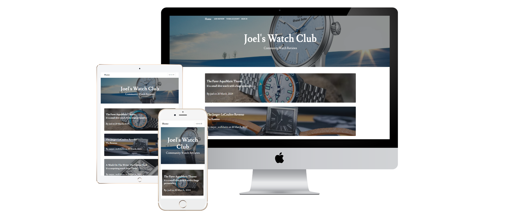
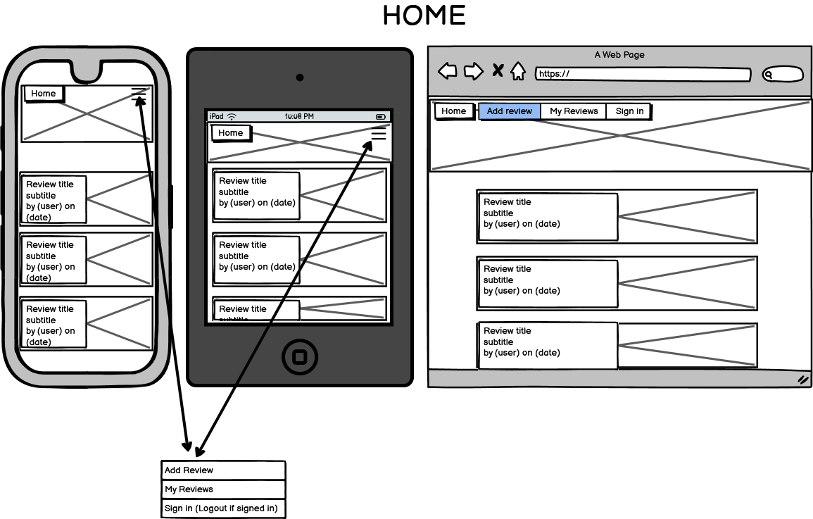
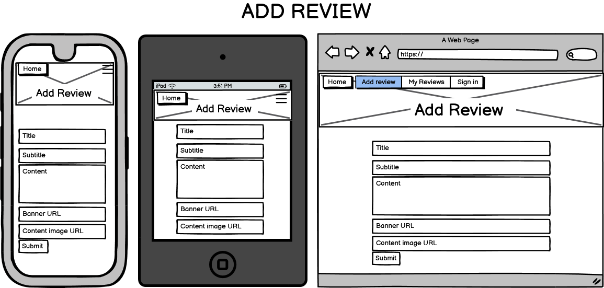

# Joel's Watch Club

## Code Institute Milestone Project 2

[Click here to view the live project]()

- [Joel's Watch Club](#joels-watch-club)
  - [Table of Contents](#table-of-contents)
  - [Introduction](#introduction)
  - [UX](#ux)
  - [Features](#features)
  - [Issues and Bugs](#issues-and-bugs)
  - [Technology Used](#technologies-used)
  - [Testing](#testing)
  - [Deployment](#deployment)
  - [Credits](#credits)
  - [Acknowledgements](#acknowledgements)

## Introduction

Joel's Watch Club is a website designed to build a community around people who have an interest in watches or who have an interest in making a purchase of a watch.

The funcitonality of the website is very simple - designed so the different user types can get what they want as soon as they enter the website.

This was the third Milestone Projects as part of my course at the Code Institute. The main requirements were to make a website that utilised a CRUD database, using flask and SQLAlchemy.

---

## UX

### Demographics

The aim for me is to create a website that appeals to:

- New users
- Current users

### User Stories

#### New Users

- As a new user, I want to be able to read other users reviews as soon as I enter the site. 
- As a new user, I want to be able to create a unique user ID to login with in future.
- As a new user, I want to be able to be able to post a new review after I create my unique user.

#### Current Users

- As a current user, I want to be able to login to access a view of my reviews.
- As a current user, I want to be able to edit or delete my previous reviews as well as post new ones.
- As a current user, I want to be able to view the latest posts on the home page easily.

---

## Development Planes

#### Strategy

The strategy was 

- roles

  - Current users
  - New Users
  - Users looking for new content related to watches

- Demographic

  - Typically aspirational adults, male or female
  - Residing in the UK or USA (English spoken)
  - An interest in watches
  - Looking to view others opinions and share their own

- Psychographic
  - Lifestyles
    - Looking at luxury products for own purchases
    - Potentially a collector of watches
  - Personality and Attitudes
    - Aspirational
    - Open to others ideas and opinions
    - Values community
- Values
  - Interested in watches and the associated qualities (horology, craftsmenship, hand made etc.)
  - Interested in sharing ideas

This website needs to enable the user to:

- Create a unique user with a secure password
- Post reviews with title, subtitle and content
- Edit the same categories of the reviews as stated above (title, subtitle,content)
- Delete unwanted reviews

With this in mind I have produced a short diagram representing the viability of elements versus importance within the site.

Viability chart

[Back to top](#joels-watch-club)

---

### Scope

Based on the requirements of the Strategy plane, I have identified two categories.

- Content Requirements:

  - A home page populated with the reviews
  - Ability to open said reviews into their own page to view full content
  - A listed view of users own reviews

- Function Requirements:
  - A sign up and sign in function
  - Log out function
  - Create new review function
  - Edit review function
  - Delete review function

---

### Structure

Based on the information so far, I intend to have a home page with links to everything a user needs to get started. From there, links to sign up will appear, and if the user is signed in a logout button will appear.

Users will not be able to post a review or view the user dashboard without being logged in. 

The intended path will be as follows:

#### Unregistered User

 - View Reviews on home page
 - Add review -> login required, please sign in (sign in redirect)
 - Sign in (No user? sign up here -> Sign Up -> Login (redirect) -> User Dashboard (redirect)

#### Existing User

 - View Reviews on home page
 - Add review -> login required, please sign in (sign in redirect)
 - Sign in -> User Dashboard (redirect)
 - Add review -> User dashboard (redirect after post)
 - User dashboard -> Edit post -> User dashboard (redirect after edit)
 - Log out -> Sign in (redirect)

Below is a map created using Balsamiq - 

Site Map

---

### Skeleton

Wireframes were produced using balsamiq. These will showcase the site as intended on mobile and desktop.

Wireframes

Home

View Review

Add Review

User Dashboard

Sign In

Sign Up

Edit Review

About

---

### Surface

The majority of the colour will be very simple for readability. Background will be white, text will be a very dark grey for subtlety and elegance. 

With the navigation will be white to stand out against the banner images.

I have decided to keep the colour palette simple as the website is heavily focused on what users create.

The delete post button will be red to reflect a warning that this is permanent.

Colour Palette

### Typography

The typography I will use will be from Google Fonts.

The titles will be 'lusitana'. In keeping with this, the rest of the text in the site will be 'lusitana'. Back up font will be 'Georgia'.

Both are uncomplicated and elegant fonts chosen for readability.

### Imagery

All imagery will be from Hodinkee, a watch news site, and urls will be passed from there to simulate user reviews. Credit will be listed at the bottom of ReadMe.

[Back to top](#joels-watch-club)

---

## Features

The website features a set of functional.

---

### Sign Up

---

### Sign In

---

### Login

---

### Logout

---

### Add review

---

### Delete review

---

### Edit review

---

### Future features

Due to time constraints I was unable to implement the following functions, however the would make a nice addition to the website:

- 
- 
- 

[Back to top](#joels-watch-club)

---

## Issues and Bugs

### 

### 

###

### 

### 

---

## Technologies Used

---

### Main Languages Used

- HTML5
- CSS
- Jinja
- Python
- Limited use of javascript
- Flask
- SQAlchemy
- CK editor
- Werkzeug security

### Frameworks, Libraries and Programs

- Google Fonts
  - GoogleFonts was used to import the Shizuru and Gloria Hallelujah fonts which were used in this project.
- Font Awesome
  - Font Awesome was used to import the Speaker icon for muting music.
- CodeAnywhere
  - CodeAnywhere was used for writing code, commiting and pushing to GitHub.
- GitHub
  - GitHub was used to store the project.
- Balsamiq
  - Balsamiq was used to create wireframes at the beginning of the project.
- Coolors
  - Coolors was used to create a simple colour palette for the website.
- FreeFormatter
  - FreeFormatter was used to beautify my HTML and CSS code and ensure it was optimal for reading.
- W3C Validator
  - W3C Validator was used at the end of the project to check forany errors written in my code for both HTML and CSS.
- w3Schools
  - Here I learned how to implement audio and change class items such as the background images.
- Youtube
  - I used extensively whenever I ran into a problem or something I had not done before such as creating modals.

---

## Testing

Please view full testing document [here]()

---

## Deployment

---

This project was developed using CodeAnywhere and was then committed to GitHub using the GitPod terminal.

### Deploying

---

To deploy this page to GitHub Pages from its GitHub repository, the following steps were taken:

- 
- 
- 
- 
- 
- 
- 

---

## Credits

---

- Images from
- Youtube guide
- Forum post
- Tutor Sarah
- CleanBlog 
- w3schools, 

---

## Acknowledgements

---

- I would like to thank my family and friends for helping with testing and developing the user experience.
- I Would like to thank my mentor, Seun, for their guidance and experience, and my tutors, Oisin and Sarah for helping me with any difficulties with bugs.
- I'd also like to thank the Code Institute Slack community who are always available for help.

[Back to top](#joels-watch-club)

---