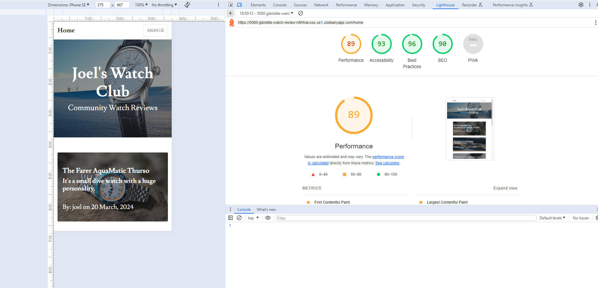
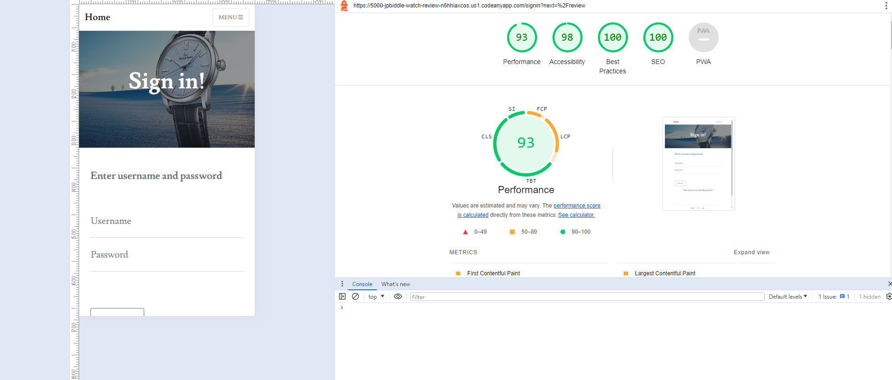
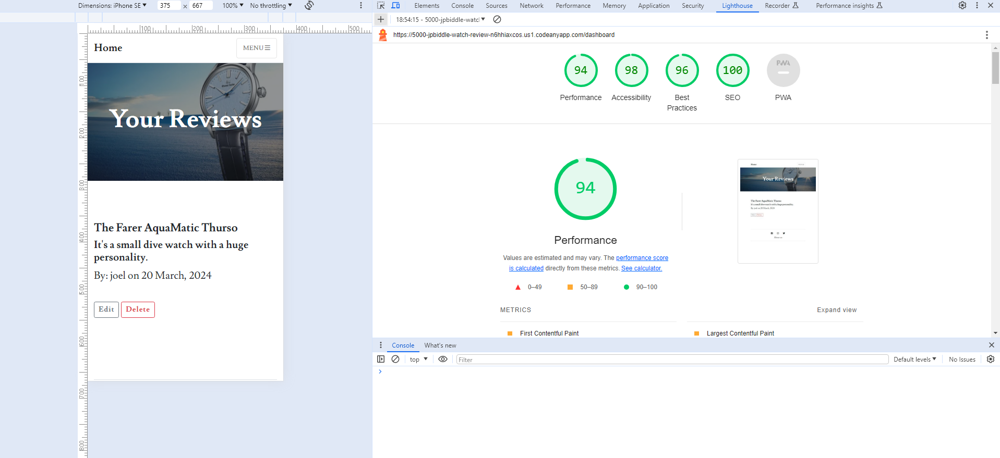
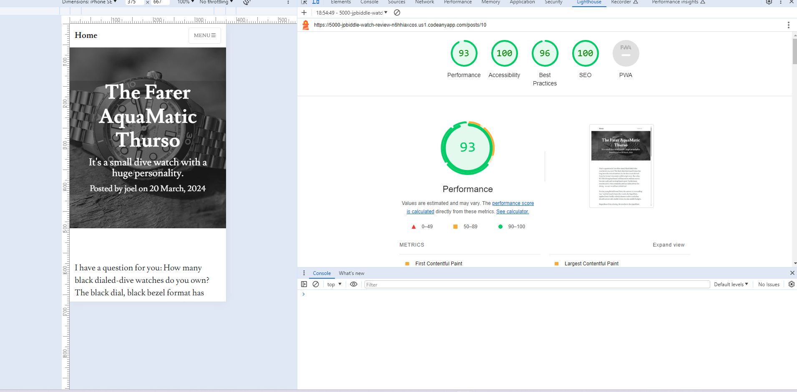
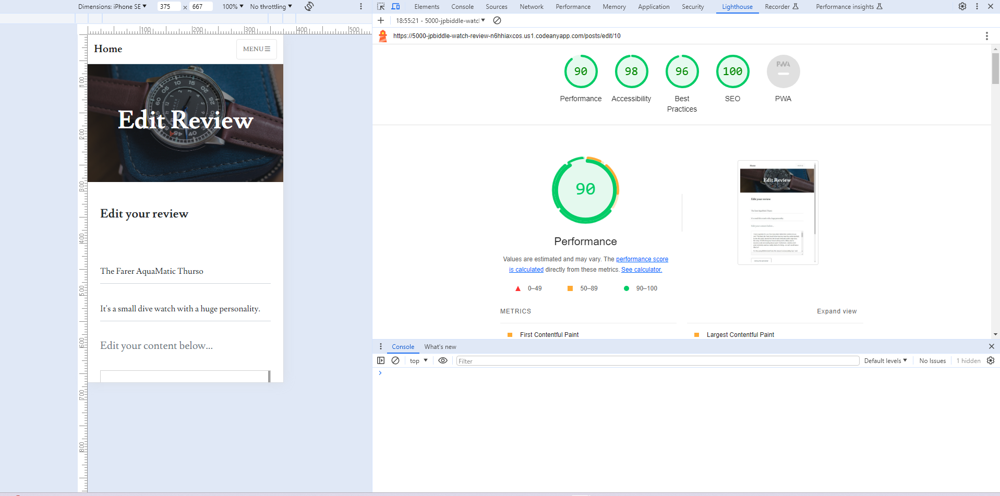
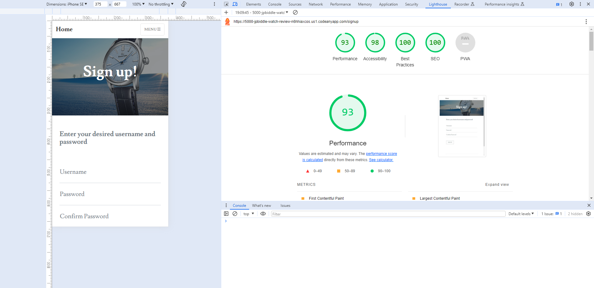

# Joel's Watch Club Matching Testing

[Main README.md file](https://github.com/JPBiddle/watch-review/blob/main/README.md)

[View Live Project]()

# Contents

- [Joel's Watch Club Testing](#joels-watch-club-testing)
- [Contents](#contents)
  - [Testing User Stories](#testing-user-stories)
    - [First time visitor](#first-time-visitor)
    - [Returning visitor](#returning-visitor)
  - [Manual Testing](#manual-testing)
  - [Automated Testing](#automated-testing)
    - [Code Validation](#code-validation)
    - [Lighthouse](#lighthouse)
  - [Further Testing](#further-testing)

---

## Testing User Stories

### First time visitor

- As a first time visitor, I would like to be able view content easily.

  - Reviews are displayed on the home page, available without login
  - Clicking on a review brings up a page with the full content.
  - The about page and social links are working at the bottom of all pages.

- First time visitors want to be able to create an account and start posting content.

  - The user is guided easily to the sign up page via sign in.

- As a first time visitor I want to know what the site is about.
  - The about page gives detail about what the purpose of the site is.

### Returning visitor

- As a returning visitor, I would like to access my content seperately from the main content.

  - After logging in all the users content is visible to them on the dashboard.

- As a returning visitor I would to edit or delete my previous content as well as post new content.
  - Edit and delete functions are available on the dashboard, and access to post reviews is granted.

---

## Manual Testing

Extensive testing was conducted manually to ensure all parts of the website function as intended.
Below are screenshots of the testing in progress, going through each page and checking everything functions.

### Home

Testing that reviews appear on home page, are clickable and appear latest at the top by date.

Reviews on home

.png)

Review on click, checking for content

.png)

Review on click, checking for content, scrolled

.png)

About page

.png)

### Navigation

Testing that 'Add Review' login required

Login Required

.png)

Testing that 'My Reviews' login required

Login Required

.png)

### Sign up

Testing the sign up page to ensure reuired fields, password confirmed, ensure user doesn't already exist and if so, please choose a different username.

Username required for sign up

.png)

Password required for sign up

.png)

Passwords don't match

.png)

Passwords match

.png)

Username exists

.png)

Successfully created user, redirect to sign in

.png)

### Sign in

Testing sign in page, checking form requirements, entering a user that doesn't exist and entering password incorrectly.

Sign in from nav

.png)

User doesnt exist

.png)

Check required form

.png)

Check required form

.png)

Check incorrect password

.png)

Successful sign in

.png)

### Log out

After successful login, log out and return to sign in page.

Successful log out

.png)

### Add Review page

Add review page has been tested ensure it cannot be accessed before login - now a test login is used to fill out the add review page and submit it, checking the review appears on home page and in user dashboard.

Page accessed with login

.png)

Check required fields

.png)

Test review posted with flash message, appears in dashboard

.png)

Review appears on home page

.png)

Review when clicked

.png)

### Edit review

On the dashboard the user may edit a review. The dashboard has been tested to check that it doesn't allow users to access it without login. The edit page was tested to check required fields and then the test review was edited - the edit was reflected on the dashboard and home page.

Edit page form populated with existing test post

.png)

Edited post with changes in dashboard, plus flash message

.png)

### Delete post

On the user dashboard, the delete post function was tested. The correct modal popped up to warn users that deletion was permanent, and when confirmed the post disappeared from home page and dashboard, with flash message appearing.

Delete message modal

.png)

Delete confirmed

.png)

---

## Automated Testing

### Lighthouse

Part of my testing was using Lighthouse from Chrome to check accessibility, SEO performance and general loading performance.
Below is a screenshot of the current Lighthouse results.

Upon testing with lighthouse I was satisfied with all pages other than home - the Clean Blog theme I used had an excess of CSS in the CSS file I imported, which was slowing loading somewhat.

If I had more time I would clean this up and in future I will be very careful about importing themes.

Lighthouse Home

Lighthouse Sign in

Lighthouse Dashboard

Lighthouse review example

Lighthouse Edit

Lighthouse add review

Lighthouse sign up

End of TESTING Doc
---